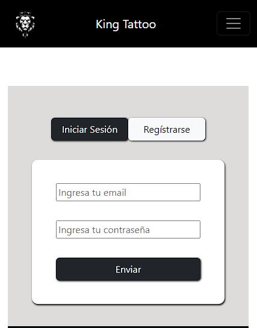
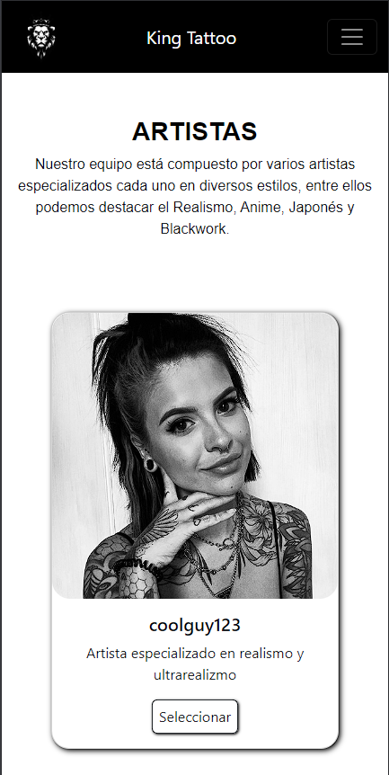
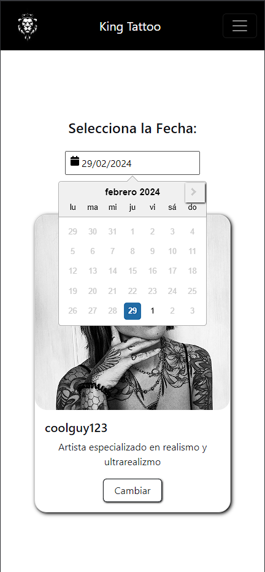
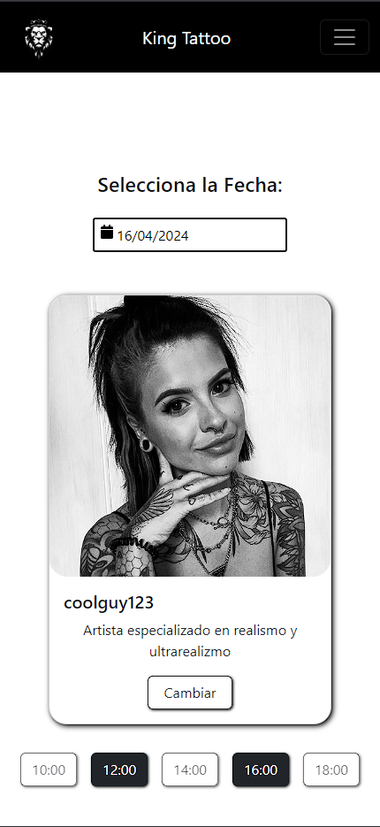
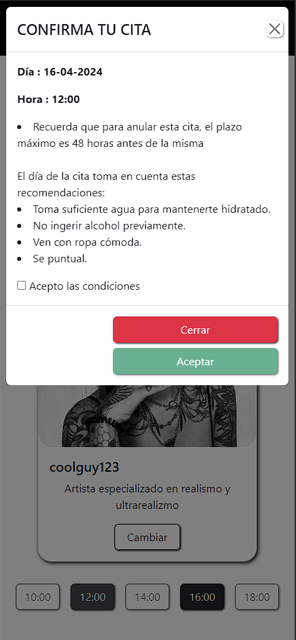
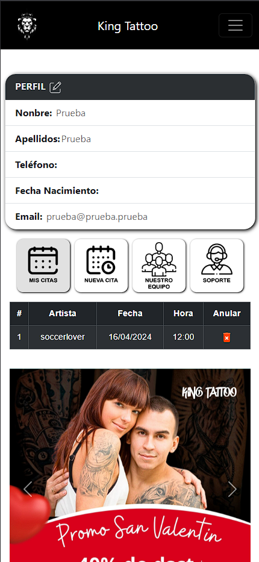
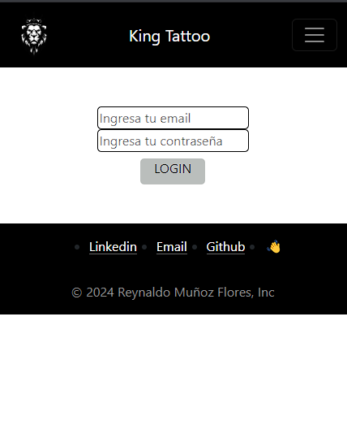
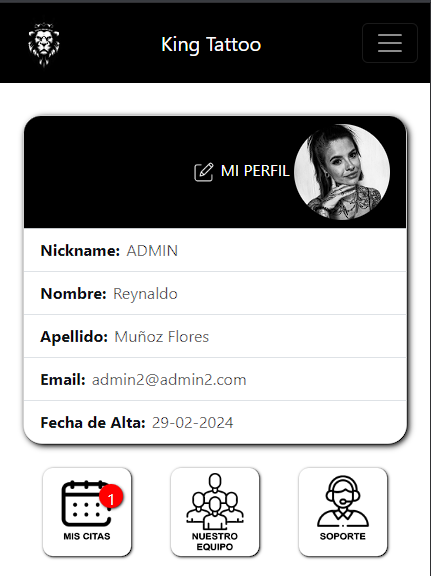
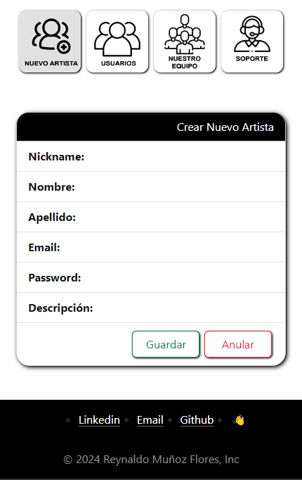

# Welcome to my backend app

## king_tattoo


<details>
  <summary>Contenido 📝</summary>
  <ol>
    <li><a href="#objetivo">Objetivo</a></li>
    <li><a href="#sobre-el-proyecto">Sobre el proyecto</a></li>
    <li><a href="#stack">Stack</a></li>
    <li><a href="#instalación-en-local">Instalación</a></li>
    <li><a href="#endpoints">Manual de Uso</a></li>
    <li><a href="#futuras-funcionalidades">Futuras funcionalidades</a></li>
    <li><a href="#contribuciones">Contribuciones</a></li>
    <li><a href="#licencia">Licencia</a></li>
    <li><a href="#webgrafia">Webgrafia</a></li>
    <li><a href="#desarrollo">Desarrollo</a></li>
    <li><a href="#agradecimientos">Agradecimientos</a></li>
    <li><a href="#contacto">Contacto</a></li>
  </ol>
</details>

## Objetivo
Este proyecto requería un frontal para poder utilizar el backend creado en un proyecto anterior

<a href="https://github.com/ReynaldoMunozF/king_tattoo_backend" target="_blank"></a> 


## Sobre el proyecto
En esta ocasión se nos requiere generar una parte frontal que conecte con
nuestra API encargada de gestionar el modelo de negocio de un estudio de tatuajes.

Para ello, generaremos las vistas necesarias para poder registrarnos y
logearnos como usuarios, ver nuestro perfil de usuario con datos editables y una
vista en la cual podremos ver nuestro historial de citas. Se valorará muy
positivamente la posibilidad de realizar una búsqueda o filtrado de citas.
Además de ello tendremos que generar una vista capaz de permitirnos
agendar una nueva cita.
No debemos olvidar que los tatuadores podrán acceder como profesionales y
ello les permitirá ver qué citas tienen en adelante junto con los datos personales o
historiales de los clientes con los que trabajen.
Por último, debemos tener una vista de administrador desde la que se tendrá
acceso a todos los usuarios y citas disponibles en la aplicación, que además
permitirá la edición y borrado de éstos.

## Stack
Tecnologías utilizadas:
<div >
<li>REACT</li>    
<li>REACT BOOTSTRAP</li>    
<li>JAVASCRIPT</li>    
<li>HTML</li>    
<li>CSS</li>    
 </div>

<!-- [](https://reactjs.org/) [](https://vitejs.dev/) [](https://developer.mozilla.org/en-US/docs/Web/JavaScript) [](https://redux.js.org/) [](https://jwt.io/introduction) [](https://getbootstrap.com/) [](https://axios-http.com/) -->

## Instalación en local
1. Clonar el repositorio tanto de back-end y front-end
2. ` $ npm install ` 
3. Conectamos nuestro repositorio con la base de datos 
4. ``` $ Ejecutamos las migraciones ``` 
5. ``` $ npm run dev ``` en el back-end
6. ``` $ npm run dev ``` en el front-end


## Manual de Usuario
#En la pantalla principal podras elegir entre iniciar sesión o registrarte




#En la pantalla de perfil contaras con las siguientes opciones:
* Editar tu perfil 
* Ver tus citas pendientes
* Crear una nueva Cita
* Ver a los Tatuadores actuales
* ir a la pagina de soporte 


#Al darle click en NUEVA CITA se redirigira a la pagina de Nuestro Equipo, donde podras seleccionar al tatuador con quien deseas la cita 

* luego seleeccionaras la fecha y la hora 
* Se aceptaran las condiciones dandole al checkbox de confirmacion y se creara la cita 
* En la página del perfil podras verificar que la cita esta creada dandole a mis citas 







#En el area privada podras ingresar al panel de artistas los cuales tendran las notificaciones si tienen alguna cita asignada, tambien podrán modificar su perfil




#En el area privada con permisos de super admin tendran la opcion de crear un nuevo artista, ver todos los usuarios y eliminarlos 




## Futuras funcionalidades
[ ] Añadir tipos de tatuajes 
[ ] Vizualizar Diseño de tattoo
[ ] Eliminar tatuadores desde super admin 
 

## Contribuciones
Las sugerencias y aportaciones son siempre bienvenidas.  

Puedes hacerlo de dos maneras:

1. Abriendo una issue
2. Crea un fork del repositorio
    - Crea una nueva rama  
        ```
        $ git checkout -b feature/nombreUsuario-mejora
        ```
    - Haz un commit con tus cambios 
        ```
        $ git commit -m 'feat: mejora X cosa'
        ```
    - Haz push a la rama 
        ```
        $ git push origin feature/nombreUsuario-mejora
        ```
    - Abre una solicitud de Pull Request

## Licencia
Este proyecto se encuentra bajo licencia de "MIT License"

## Webgrafia:
Para conseguir mi objetivo he recopilado información de:
- https://react-bootstrap.netlify.app/
- https://www.npmjs.com/package/react-datepicker


## Agradecimientos:

Agradezco al claustro de GeeksHub por el tiempo dedicado a darnos el contenido y el continuo seguimiento.


A mi hermano le debo una cerveza por se mi patito de goma favorito (gracias por aguntar la chapa)


- ***Rodrigo***  
<a href="https://github.com/el-ro" target="_blank"></a> 

## Contacto
<a href = "mailto:reynaldo.munozf21@gmail.com"></a>
<a href="www.linkedin.com/in/reynaldo-muñoz-flores" target="_blank"></a> 
</p>
